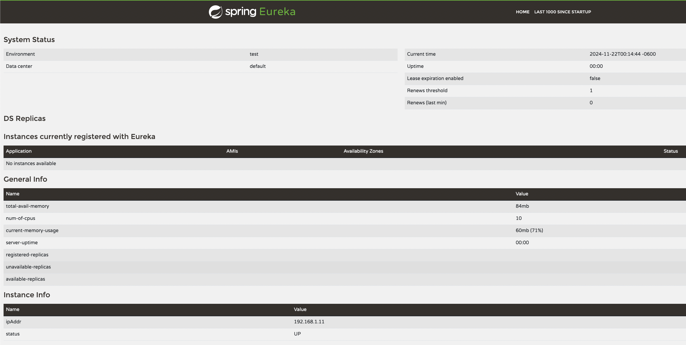

# Eureka Server

This project is an **Eureka Server** that acts as a service registry for a microservices-based architecture. Clients can register and discover other services within the ecosystem.

Link to see: http://localhost:8761



## 📋 Prerequisites

Ensure you have the following installed:

- **Java 21** (or higher).
- **Gradle** (version 7.6 or higher).
- An IDE compatible with Spring Boot (e.g., IntelliJ IDEA or STS).
- Internet connection to download dependencies.

## 🚀 Setup and Execution

### 1. Clone the Repository

```bash
git clone <REPOSITORY_URL>
cd <PROJECT_NAME>
```

### 2. Build the Project

Run the following command to build the project and verify dependencies:

```bash
./gradlew clean build
```

### 3. Run the Server

You can start the Eureka Server with the following command:

```bash
./gradlew bootRun
```

By default, the server will be available at [http://localhost:8761](http://localhost:8761).

### 4. Configure the Eureka Client

To register a client with the Eureka Server, configure the client's `application.yml` file as follows:

```yaml
eureka:
  client:
    service-url:
      defaultZone: http://localhost:8761/eureka/
```

## 📂 Project Structure

- **`src/main/java`**: Main source code.
- **`src/main/resources/application.yml`**: Configuration file for the Eureka Server.
- **`build.gradle`**: Gradle configuration file.
- **`README.md`**: Project documentation.

## 🛠 Technologies Used

- **Java 21**
- **Spring Boot 3.2**
- **Spring Cloud 2023.0**
- **Gradle**

## 🌐 Eureka Server Configuration

The `application.yml` file includes the basic parameters for configuring the server:

```yaml
server:
  port: 8761

eureka:
  client:
    register-with-eureka: false
    fetch-registry: false
  instance:
    hostname: localhost

spring:
  application:
    name: eureka-server
```

## 📖 References

- [Spring Cloud Netflix Official Documentation](https://spring.io/projects/spring-cloud-netflix)
- [Gradle Documentation](https://docs.gradle.org/)
- [Java 21 Features](https://openjdk.org/projects/jdk/21/)

## 👤 Author

- **David**  
  Backend and Fullstack Developer.  
  Always eager to learn and improve microservices projects!
